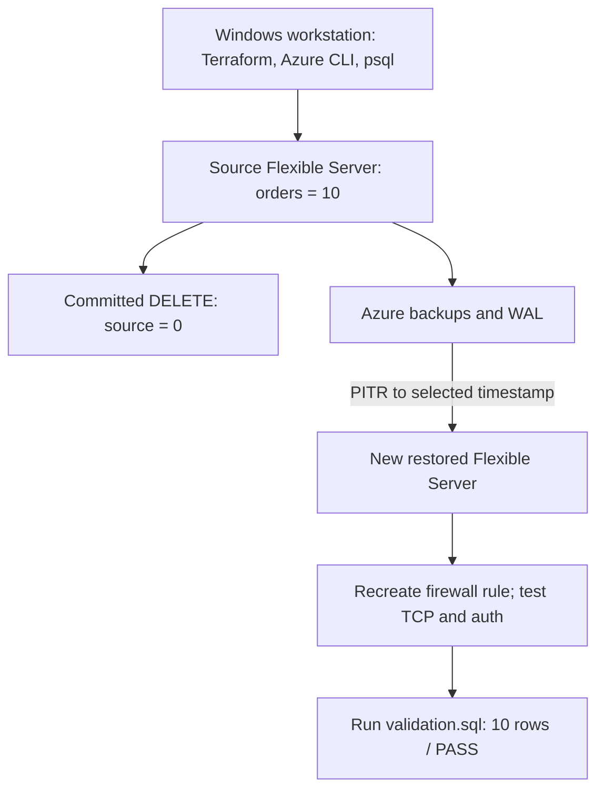
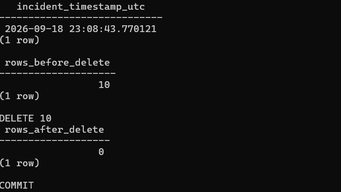
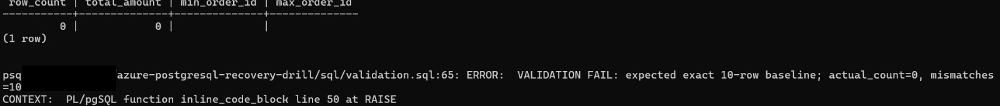
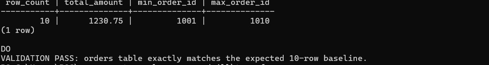

# Azure PostgreSQL Recovery Drill

Having backups enabled does not prove that usable data can be recovered.

I built this lab to test the full recovery path, not just confirm that backups were enabled. I loaded a known dataset, committed a controlled `DELETE`, restored to a timestamp from before the incident, and checked the recovered rows with the same SQL validator used at the start.

## Observed lab result

- Baseline: 10 orders / validator PASS
- After committed `DELETE`: 0 orders / validator FAIL / exit code 3
- Restored server: 10 orders / validator PASS / exit code 0
- PITR initiation to server `Ready`: 7.06 minutes
- Observed PITR initiation-to-validated-recovery duration: 14.08 minutes
- Observed incident-to-validated-recovery elapsed time: approximately 19.43 minutes
- Selected recovery-point gap before the incident: 16.70 minutes
- Cleanup: restored server deleted, Terraform state empty, Resource Group absent, and no lab servers remaining

No target RTO or RPO was defined for this lab. These are observed recovery measurements from one controlled run, not Azure service guarantees.

## Recovery flow

PITR created a new Flexible Server; it did not roll back the damaged source in place. At the end of the drill, the source still had 0 rows and the restored server had the expected 10.

## How the drill worked

1. Terraform created the source PostgreSQL server and its single-client firewall rule.
2. I loaded 10 known orders and ran `validation.sql` to confirm the baseline.
3. I saved a restore timestamp, then ran the controlled incident SQL. The transaction deleted all 10 rows and committed.
4. The source returned 0 rows and the validator failed with exit code 3.
5. Azure PITR created a separate server. Its firewall rule was not inherited, so I recreated access and tested TCP/5432 and PostgreSQL login.
6. The restored database passed the same validator. I compared both servers, removed the restored server, and then destroyed the Terraform-managed resources.

I did not treat Azure's `Ready` status as the end of recovery. The drill ended when the restored data passed validation.

## Validation approach

[`sql/validation.sql`](sql/validation.sql) checks more than the row count. It verifies:

- `COUNT(*) = 10`
- `SUM(amount) = 1230.75`
- `MIN(order_id) = 1001`
- `MAX(order_id) = 1010`
- no differences from the exact expected rows and values

It also compares the actual rows and values with the expected dataset in both directions using `EXCEPT`. Any mismatch raises a PostgreSQL exception. With psql `ON_ERROR_STOP`, the failed check returned a non-zero exit code instead of looking like a successful script run.

## Evidence from the run

The incident removed all 10 rows and committed the transaction.

The same validator then failed against the damaged source.

After PITR, the restored data matched the original baseline.

Additional sanitized screenshots and text records are indexed under [`evidence/`](evidence/README.md).

## Lab configuration

| Item | Value |
|---|---|
| Azure region | UAE North |
| Service | Azure Database for PostgreSQL Flexible Server |
| PostgreSQL | 17 |
| SKU | `B_Standard_B1ms` / `Standard_B1ms` |
| Storage | 32 GiB |
| Backup retention | 7 days |
| High Availability | Disabled |
| Geo-redundant backup | Disabled |
| Network access | Public, restricted to one current-client IPv4 |
| Database | `recoverylab` |

## Security and cost choices

For this lab I used public access so I could work directly from my Windows workstation without adding a VNet or VM. Access was limited to my current IPv4 address. I did not add a broad `0.0.0.0` firewall rule.

PostgreSQL connections used `sslmode=require`. Azure reported `require_secure_transport = on` and minimum TLS `TLSv1.2`. This encrypted the connection, but it was not the stronger hostname and certificate verification provided by `verify-full`.

Terraform state, saved plans, `.env`, `.local/`, and raw evidence are ignored by Git. I deleted the restored server before destroying the Terraform-managed resources so I did not leave two billable database servers running.

Details: [security and cost decisions](docs/security-cost.md).

## Problems I ran into

- I no longer had the original administrator password after provisioning because the Terraform workflow used a write-only password argument. I reset it in Azure and stored the replacement locally with Windows DPAPI under the ignored `.local/` directory. On another run, I would plan the credential lifecycle before provisioning.
- My first validator used `\quit 3`, but it did not return the exit status I expected with the installed psql version. I replaced it with `RAISE EXCEPTION` and `ON_ERROR_STOP`.
- I accidentally overwrote the local `Ready` timestamp file during a later check. The first observed timestamp had already been captured in the session evidence, so that is the value used in the measurements.

Details: [troubleshooting notes](docs/troubleshooting.md).

## What this project does not prove

This lab does not prove:

- multi-region disaster recovery
- enterprise High Availability
- automated failover
- production-scale workload recovery
- guaranteed RTO or RPO
- private-network-only architecture
- repeated statistical recovery performance

This was one controlled logical-data-loss recovery drill, not an enterprise DR test.

## Repository guide

- [`terraform/`](terraform/) - source infrastructure used by the lab
- [`sql/`](sql/) - schema, deterministic seed, controlled incident, and validator
- [`docs/architecture.md`](docs/architecture.md) - component and resource-ownership detail
- [`docs/recovery-runbook.md`](docs/recovery-runbook.md) - tested operational sequence
- [`docs/results.md`](docs/results.md) - timestamps, measurements, and interpretation
- [`docs/security-cost.md`](docs/security-cost.md) - security and cost tradeoffs
- [`docs/troubleshooting.md`](docs/troubleshooting.md) - problems encountered and fixes
- [`evidence/README.md`](evidence/README.md) - index of sanitized evidence records

## Reproducing the lab

Read the [recovery runbook](docs/recovery-runbook.md) before running it. It includes a destructive SQL statement that commits, and the Terraform configuration creates paid Azure resources.

Use your own globally unique server name, public IPv4, and administrator credential. Check `terraform plan` before `apply`, save the restore point before running the incident, and remember that the restored server is outside the original Terraform state and must be deleted separately.

The timings above came from the September 2026 run. Another run will produce different names, timestamps, and recovery times.
