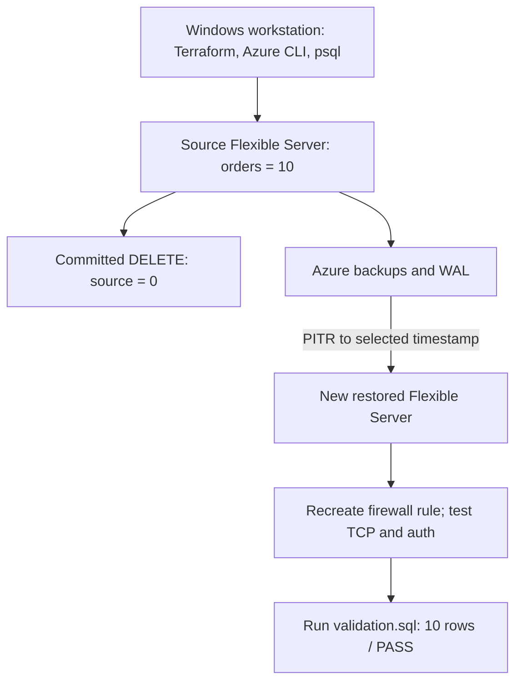

# Azure PostgreSQL Recovery Drill

Having backups enabled does not prove that usable data can be recovered.

This project tested that assumption by committing a controlled `DELETE` against a known PostgreSQL dataset, restoring Azure Database for PostgreSQL Flexible Server to a pre-incident timestamp, rebuilding access to the new server, and validating the recovered rows with a machine-detectable SQL check.

## Observed lab result

- Baseline: 10 orders / validator PASS
- After committed `DELETE`: 0 orders / validator FAIL / exit code 3
- Restored server: 10 orders / validator PASS / exit code 0
- PITR initiation to server `Ready`: 7.06 minutes
- Observed PITR initiation-to-validated-recovery duration: 14.08 minutes
- Observed incident-to-validated-recovery elapsed time: approximately 19.43 minutes
- Selected recovery-point gap before the incident: 16.70 minutes
- Cleanup: restored server deleted, Terraform state empty, Resource Group absent, and no lab servers remaining

These are observations from one controlled lab run. They are not guaranteed RTO/RPO values or Azure service guarantees.

## Recovery flow

Azure PITR created a new Flexible Server. It did not rewind or overwrite the damaged source. This made the final comparison possible: the source remained at 0 rows while the restored server contained the expected 10 rows.

## What I tested

1. Provisioned a small Azure PostgreSQL Flexible Server environment with Terraform.
2. Created and validated a deterministic 10-row `orders` dataset.
3. Selected and persisted a safe restore timestamp before the incident.
4. Committed a controlled deletion and proved the damaged state.
5. Started PITR and recorded the recovery timestamps.
6. Waited for the new server to report `Ready`.
7. Recreated network access because the source firewall rule was not inherited.
8. Verified TCP/5432, PostgreSQL authentication, and the expected database.
9. Ran the same validator against the restored data.
10. Compared the damaged source with the restored server and cleaned up all lab resources.

`Ready` was not the recovery completion criterion. Recovery ended only after the restored data passed validation.

## Validation approach

[`sql/validation.sql`](sql/validation.sql) checks that the table is queryable and reports:

- `COUNT(*) = 10`
- `SUM(amount) = 1230.75`
- `MIN(order_id) = 1001`
- `MAX(order_id) = 1010`
- no differences from the exact expected rows and values

The exact comparison uses both directions of `EXCEPT`. A mismatch raises a PostgreSQL exception; with psql `ON_ERROR_STOP`, that produces a non-zero process exit code. During the incident test, validation failed with exit code 3. After PITR, it passed with exit code 0.

## Lab configuration

| Item | Value |
|---|---|
| Azure region | UAE North |
| Service | Azure Database for PostgreSQL Flexible Server |
| PostgreSQL | 17 |
| SKU | `B_Standard_B1ms` / `Standard_B1ms` |
| Storage | 32 GiB |
| Backup retention | 7 days |
| High Availability | Disabled |
| Geo-redundant backup | Disabled |
| Network access | Public, restricted to one current-client IPv4 |
| Database | `recoverylab` |

## Security and cost decisions

Public access was a deliberate lab tradeoff so I could operate the database from my Windows workstation without adding VNet or VM scope. Both servers were restricted to one current-client IPv4; no broad `0.0.0.0` rule was used.

PostgreSQL connections used `sslmode=require`, and Azure reported `require_secure_transport = on` with minimum TLS `TLSv1.2`. This encrypted the connection, but `sslmode=require` did not provide the strongest hostname and certificate verification of `verify-full`.

Terraform state, saved plans, `.env`, `.local/`, and raw evidence are excluded from Git. The temporary PITR server was deleted before destroying the Terraform-managed source infrastructure to avoid leaving overlapping billable servers running.

Details: [security and cost decisions](docs/security-cost.md).

## Troubleshooting and lessons learned

- The Terraform workflow used a write-only administrator password argument. After provisioning, the original local credential was unavailable, so I reset the Azure administrator password and stored the replacement locally with Windows DPAPI in the ignored `.local/` directory.
- An early validator attempt used `\quit 3`, which did not return the intended exit status with the installed psql version. The final validator uses `RAISE EXCEPTION` with `ON_ERROR_STOP`.
- The first observed `Ready` timestamp was preserved as the availability measurement after a later timestamp accidentally overwrote the local file.

Details: [troubleshooting notes](docs/troubleshooting.md).

## What this project does not prove

This lab does not prove:

- multi-region disaster recovery
- enterprise High Availability
- automated failover
- production-scale workload recovery
- guaranteed RTO or RPO
- private-network-only architecture
- repeated statistical recovery performance

It is one tested logical-data-loss recovery drill.

## Repository guide

- [`terraform/`](terraform/) - source infrastructure used by the lab
- [`sql/`](sql/) - schema, deterministic seed, controlled incident, and validator
- [`docs/architecture.md`](docs/architecture.md) - component and resource-ownership detail
- [`docs/recovery-runbook.md`](docs/recovery-runbook.md) - tested operational sequence
- [`docs/results.md`](docs/results.md) - timestamps, measurements, and interpretation
- [`docs/security-cost.md`](docs/security-cost.md) - security and cost tradeoffs
- [`docs/troubleshooting.md`](docs/troubleshooting.md) - problems encountered and fixes
- [`evidence/README.md`](evidence/README.md) - index of sanitized evidence records

## Reproducing the lab

Read the [recovery runbook](docs/recovery-runbook.md) before executing anything. The runbook includes a committed destructive statement and creates paid Azure resources.

Use your own globally unique server name, current public IPv4, and administrator credential. Review `terraform plan` before `apply`, select the restore point before running the incident, and delete the out-of-band restored server before `terraform destroy`.

The measured timings above belong to the completed September 2026 run. A repeat run will produce different resource names, timestamps, and recovery durations.
