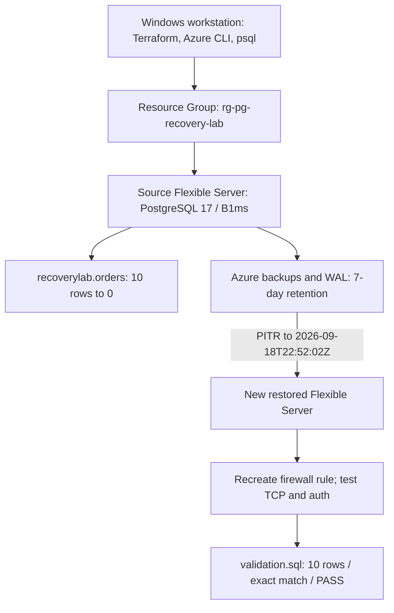

# Recovery Architecture

## Operational flow

The source and restored servers existed together during validation. PITR did not modify the damaged source server.

## Implemented source configuration

| Setting | Lab value |
|---|---|
| Region | UAE North |
| PostgreSQL | 17 |
| Compute | `B_Standard_B1ms` (`Standard_B1ms` in Azure output) |
| Storage | 32 GiB |
| Backup retention | 7 days |
| Storage autogrow | Disabled |
| High Availability | Disabled |
| Geo-redundant backup | Disabled |
| Network | Public access |
| Firewall | One current-client IPv4 |
| Database | `recoverylab` |
| Administrator | `pgrecoveryadmin` |

Terraform managed five objects: a random server-name suffix, Resource Group, source Flexible Server, database, and source firewall rule.

## Recovery boundary

The restored server was created by the Azure PITR operation, outside the original Terraform state. The recovery procedure therefore had two ownership paths:

| Resource | Created by | Cleanup method |
|---|---|---|
| Source server and database | Terraform | `terraform destroy` |
| Source firewall rule | Terraform | `terraform destroy` |
| Resource Group | Terraform | `terraform destroy` |
| Restored server | Azure CLI PITR command | Explicit Azure CLI delete |
| Restored firewall rule | Azure CLI | Removed with restored server |

Deleting the restored server first prevented an out-of-band resource from being overlooked during Terraform cleanup.

## Networking after restore

The lab observed that the source firewall rule was not present on the restored server. Microsoft also documents firewall rules, private endpoints, and virtual network rules as post-restore settings that are not copied from the source.

The tested sequence was:

1. Observe the restored server in `Ready` state.
2. Confirm the firewall-rule list is empty.
3. Add one rule for the workstation's current public IPv4.
4. Confirm TCP port 5432 is reachable.
5. Authenticate with `psql`.
6. Run data validation.

`Ready` represented control-plane availability. Validated recovery required data-plane connectivity, authentication, and a passing dataset check.

## Failure and validation states

| State | Source rows | Restored rows | Validator |
|---|---:|---:|---|
| Baseline | 10 | Not created | PASS |
| After incident | 0 | Not created | FAIL / exit 3 |
| After validated recovery | 0 | 10 | Restored PASS / exit 0 |

## Scope

This architecture represents one small, same-region PITR exercise. It does not include HA, geo-redundant backup, multi-region failover, application traffic switching, private networking, or production load.

See [results](results.md) for the measured run and the [runbook](recovery-runbook.md) for the operational steps.
